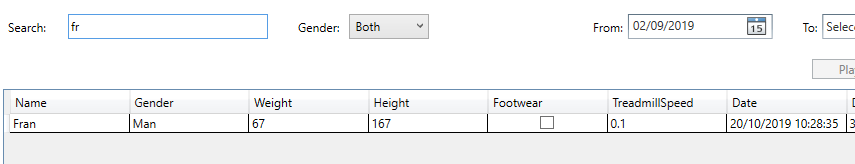

# Installation
## 1. Install Kinect dependencies
* [Kinect Runtime 2.0](https://www.microsoft.com/en-us/download/details.aspx?id=44559)
* [Kinect SDK 2.0](https://www.microsoft.com/en-us/download/details.aspx?id=44561)

## 2. Usage

### 2.1 Client App:
Fill "Server IP" textbox wit server IP shown in Server app and press "Connect" button, if it has been already introduced a valid IP it will be autofilled. Status bar will be showing application status and Kinect device current FPS.

<figure>
  
  <figcaption>Before connecting.</figcaption>
</figure>

<figure>
  
  <figcaption>After connecting.</figcaption>
</figure>

### 2.2 Server App:

#### 2.2.1 Server home menu:

Home view of Server application to decide between modules:
* Session
* Data history

<figure>
  
  <figcaption>Home menu.</figcaption>
</figure>

#### 2.2.2 Server session recording:

Session view to record session after connecting with Client application.

<figure>
  
  <figcaption>Before connecting. IP list.</figcaption>
</figure>

<figure>
  
  <figcaption>Preparing before session.</figcaption>
</figure>

<figure>
  
  <figcaption>Before 30s session.</figcaption>
</figure>

<figure>
  
  <figcaption>After 30s session.</figcaption>
</figure>

#### 2.2.3 Server session saving:

Save session view to save recorded sessions

<figure>
  
  <figcaption>Searching for an athlete id that is not present.</figcaption>
</figure>

<figure>
  
  <figcaption>Searching for an athlete id that is present.</figcaption>
</figure>

<figure>
  
  <figcaption>Filling missing information before being able to save.</figcaption>
</figure>

#### 2.2.4 Server data history:

Data history contains all recorded sessions and can be filtered by:
* Complete match of ID
* Full or beggining of name
* Gender (Man/Woman/Both)
* From date
* To date

Selected sessions can be:
* Deleted (Single/Multi select)
* Played (Single select)
<figure>
  
  <figcaption>Full data history view.</figcaption>
</figure>

<figure>
  
  <figcaption>Searching incomplete/invalid id yields not results.</figcaption>
</figure>

<figure>
  
  <figcaption>Searching complete/valid id yields results.</figcaption>
</figure>

<figure>
  
  <figcaption>Searching by name or beggining of name.</figcaption>
</figure>

<figure>
  
  <figcaption>Filtering by From date.</figcaption>
</figure>

<figure>
  
  <figcaption>Filtering by From date.</figcaption>
</figure>

#### 2.2.5 Server session re play:

<figure>
  
  <figcaption>Playing an stored session.</figcaption>
</figure>